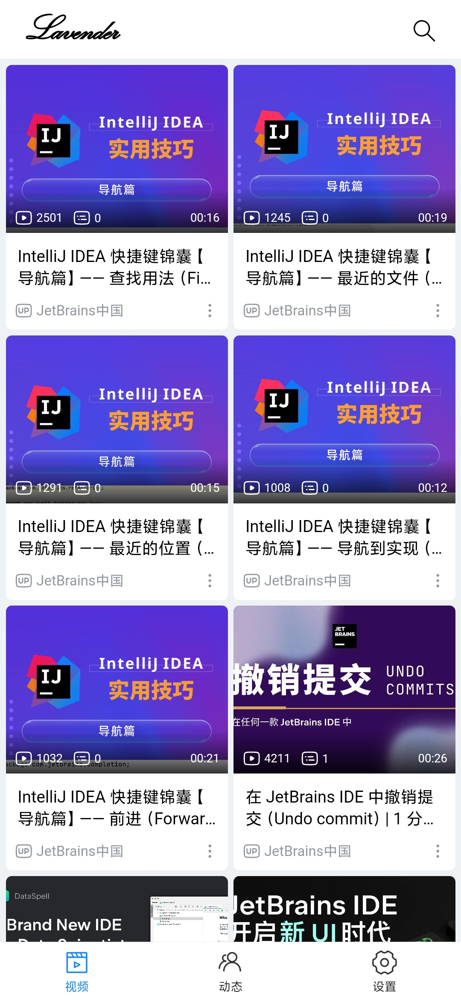
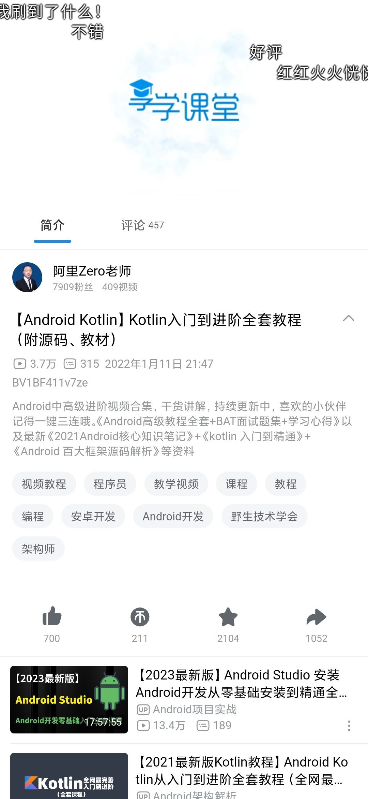
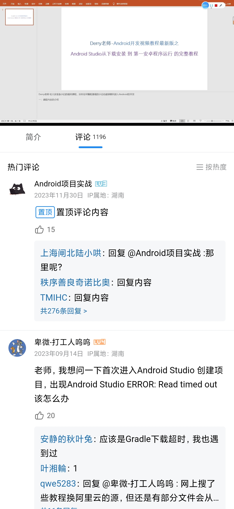
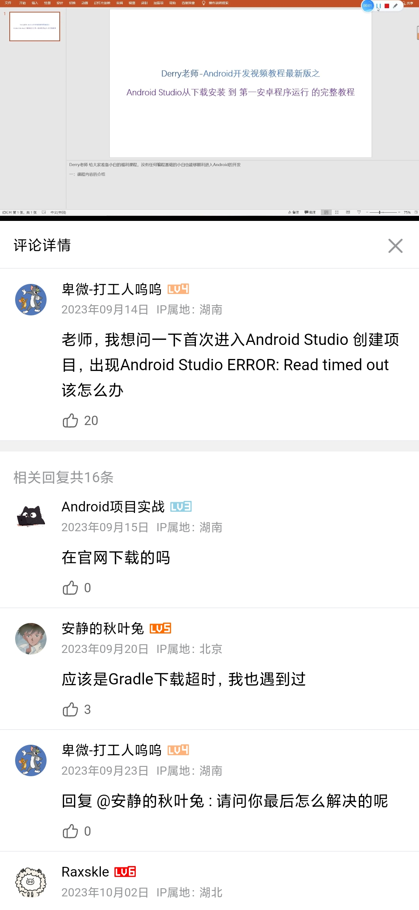
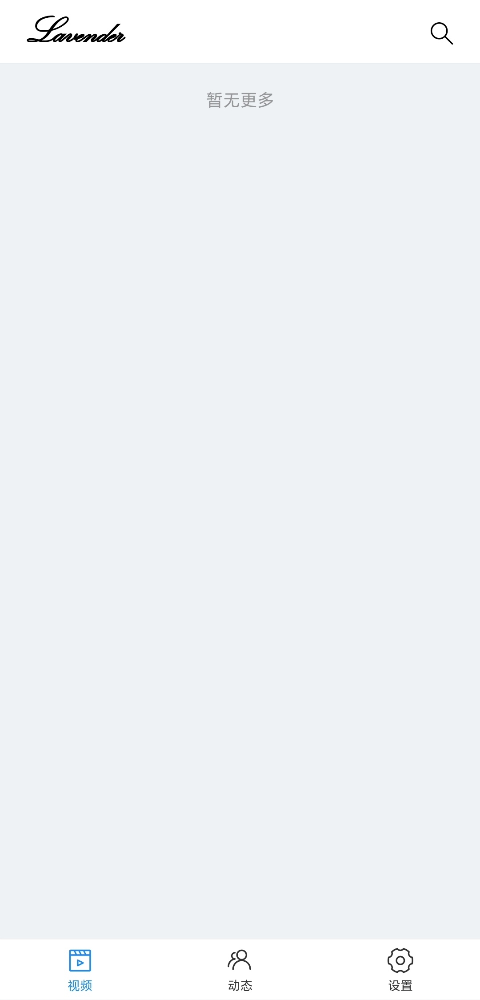
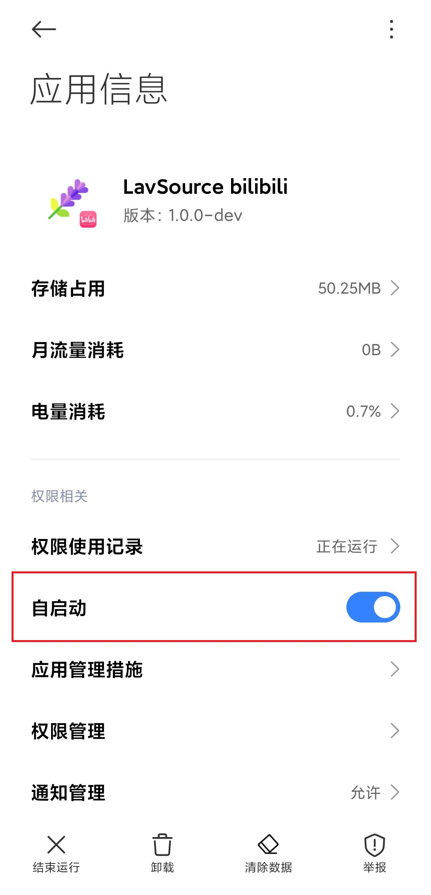
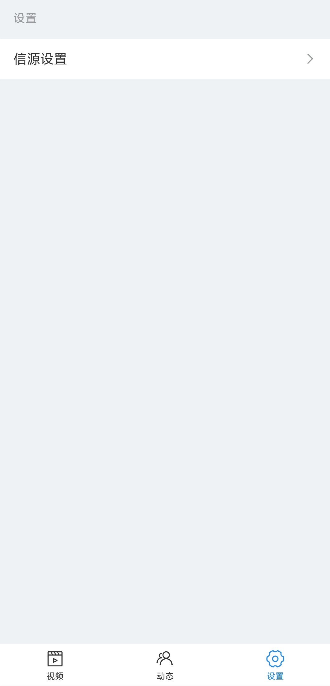
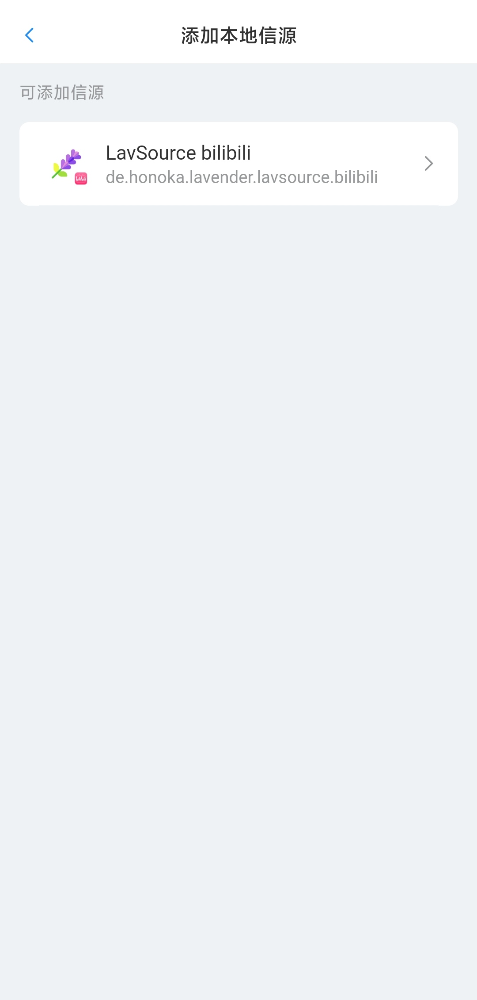
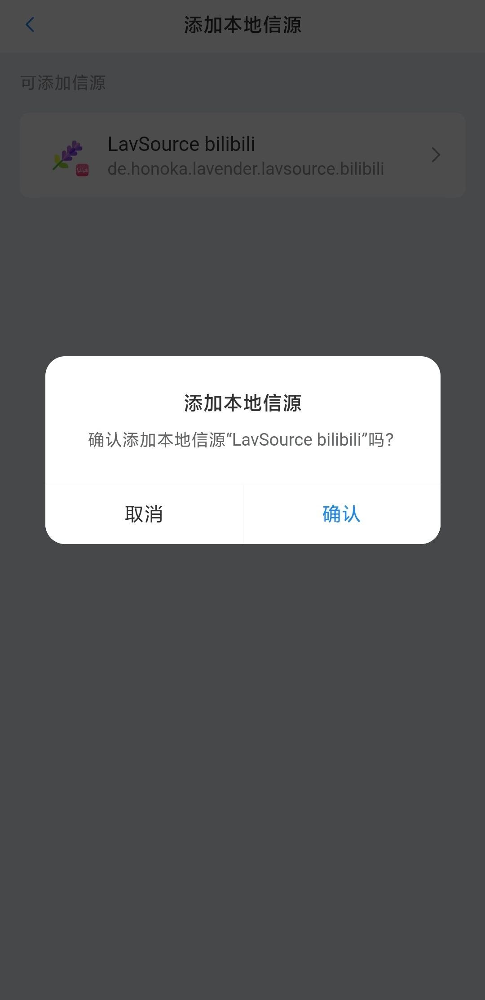
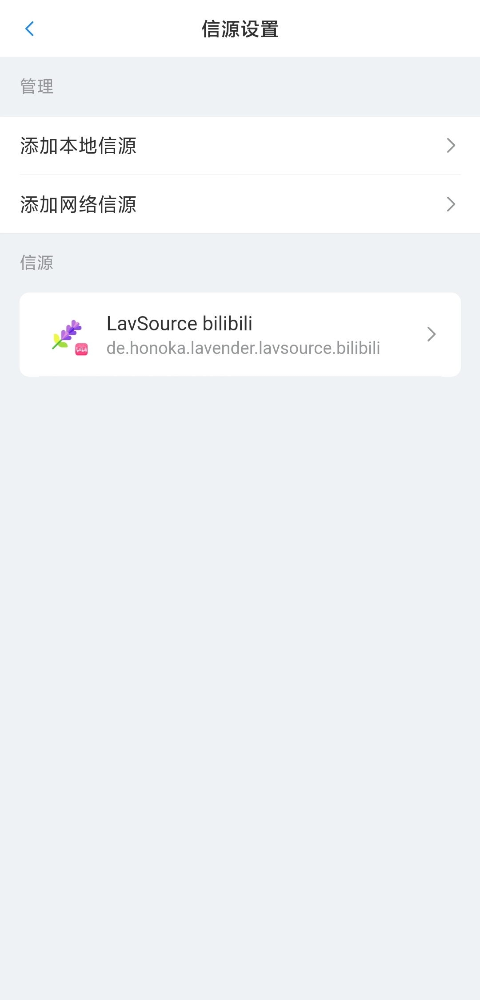

# Lavender

 

## 简介
Lavender是一款简约、通用、多信源的媒体与文章信息浏览应用，旨在实现多种不同来源的信息的聚合浏览，以及符合用户期望的信息筛选。应用的主要界面的UI，根据bilibili App临摹复刻而来。

Lavender的定位为**信息浏览应用**，因此不提供任何互动功能，如点赞、发表评论和回复、私信等。

本项目采用AGPL-3.0 License，其要求：
- 本项目的衍生项目需采用AGPL-3.0 License。
- 需在修改的文件中附有明确的说明，并包含所修改的部分及具体的修改日期。
- 通过任何形式发布衍生项目的可执行程序时，或对衍生项目进行部署，并通过网络提供服务时，**必须**同时附带或公布衍生项目的源代码。

**请严格遵守开源许可证中规定的相关要求，任何开发者在利用本项目或本项目中的任何一部分代码进行开发时，产生的任何形式和性质的影响，均由具体的开发者承担，与Lavender的原作者无关。**

**本项目仅供学习、研究等非商业用途，切勿将本项目或本项目中的任何一部分代码用于商业用途。**

## 演示
**注意：以下演示中出现的相关视频、评论和回复内容，均由算法推荐结合人工筛选而来，展示的任何内容均不代表作者立场。**

<!--suppress ALL -->
&emsp;
&emsp;
&emsp;

## 使用
Lavender应用本身不提供任何信源，因此需结合被称为LavSource的信源使用。

LavSource是一种根据[lavender-sdk](https://github.com/lavender-projects/lavender-sdk)开发而来，适配了Lavender信源规范的应用。LavSource有两种，分别是本地信源（App信源）和网络信源。

Lavender在安装后被直接打开时，首页是看不到任何视频的，需要添加信源后，Lavender才能获取到数据。

以[lavsource-bilibili](https://github.com/lavender-projects/lavsource-bilibili)本地信源为例，需首先下载并安装LavSource bilibili应用（可在其GitHub仓库中的Releases或Actions栏目中找到安装包），然后在应用管理界面，将LavSource bilibili应用设置为允许自启动。

需要将本地信源设置为允许自启动的原因是，Lavender需要通过这些应用将各个信源提供的数据，转化为符合Lavender所定义的API的数据，然后再从这些应用中获取转化后的数据。系统默认情况下不允许任何应用将未被设置为允许自启动的另一个应用唤醒，因此若不允许本地信源自动启动，Lavender将无法与之通信。

将本地信源设置为自启动后，返回Lavender应用，在设置页→信源设置→添加本地信源中找到LavSource bilibili应用。

&emsp;
&emsp;

点击LavSource bilibili应用，并确认添加。添加成功后，返回信源设置页即可看到LavSource bilibili应用。

&emsp;

此时再返回视频推荐页，即可看到推荐视频列表。

如果您在安装和使用过程中遇到任何问题，请在[Issues](../../issues)栏目中描述您的问题。

## 功能
目前已实现的功能如下：
- 本地信源支持
- 视频推荐
- 视频播放页相关功能
  - 视频基本信息（标题、简介、标签）
  - 视频数据（播放量、弹幕数、点赞量、投币量、转发量）
  - 单分P视频播放
  - 视频弹幕
  - 视频画质切换
  - 关联视频列表
- 评论区
  - 置顶评论
  - 按热度或时间排序
  - 基本表情与特殊表情（如bilibili中通过购买装扮获得的表情）
  - 评论回复列表（楼中楼）

计划实现的功能如下：
- 网络信源支持
- 多维度信息筛选过滤（根据关键词或正则表达式）
- 视频搜索
- 视频播放页相关功能
  - 多分P视频播放
  - 竖屏视频播放（全屏及非全屏）
  - 播放器滑动调节进度、亮度和音量
  - 常驻进度条（在播放器控制栏隐藏时显示在播放器底部的细进度条）
  - 全屏播放相关功能
    - 显示标题
    - 切换分P
  - 后台播放与息屏播放
- 评论区
  - 认证用户标识
  - 稿件（视频、动态、文章等）发布者标识
  - 图片
  - 头像、用户名、@用户名等内容的点击跳转
  - 评论内容中的网址的点击跳转
- 用户详情页
  - 基本信息（头像、用户名、简介等）
  - 动态列表
  - 视频投稿列表
  - 文章投稿列表
- 动态列表
- 动态详情页
  - 图文内容
  - 大图浏览器
    - 滑动切换
    - 图片保存
- 文章详情页
  - 富文本浏览
- 稿件收藏功能
  - 个人收藏列表
- 浏览历史功能
  - 浏览历史列表
- 应用设置与过滤规则列表导入导出功能

## 鸣谢
### 开源项目
- bilibili-API-collect: [https://github.com/SocialSisterYi/bilibili-API-collect](https://github.com/SocialSisterYi/bilibili-API-collect)
- nplayer: [https://github.com/oyuyue/nplayer](https://github.com/oyuyue/nplayer)
- vant: [https://vant-ui.github.io/vant/#/zh-CN](https://vant-ui.github.io/vant/#/zh-CN)
- dash.js: [https://github.com/Dash-Industry-Forum/dash.js](https://github.com/Dash-Industry-Forum/dash.js)

### JetBrains
[IntelliJ IDEA](https://zh.wikipedia.org/zh-hans/IntelliJ_IDEA)是一个在各个方面都最大程度地提高开发人员的生产力的IDE，适用于JVM平台语言。

特别感谢[JetBrains](https://www.jetbrains.com)为开源项目提供免费的[IntelliJ IDEA](https://www.jetbrains.com/idea)等IDE的授权。

